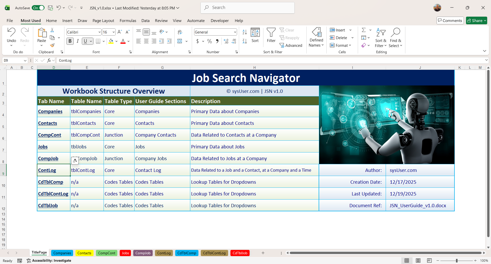
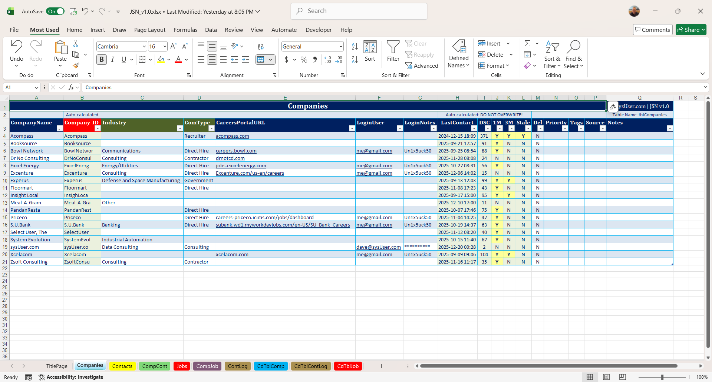
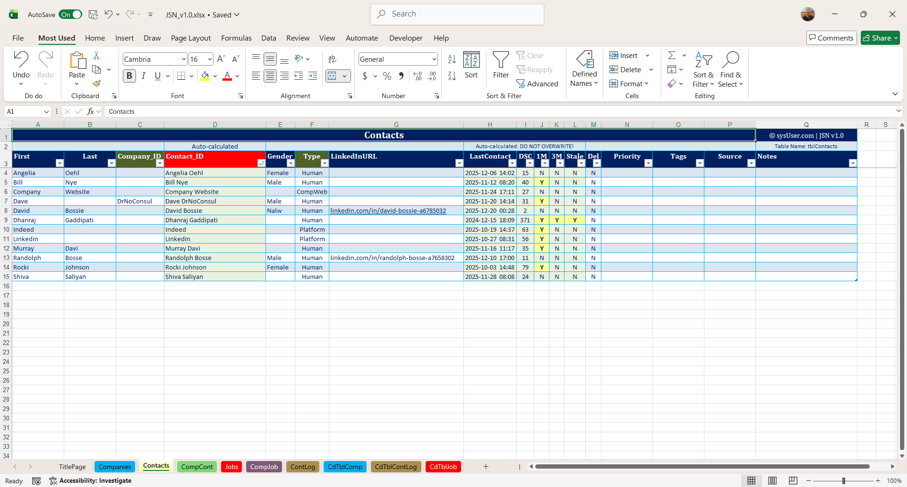
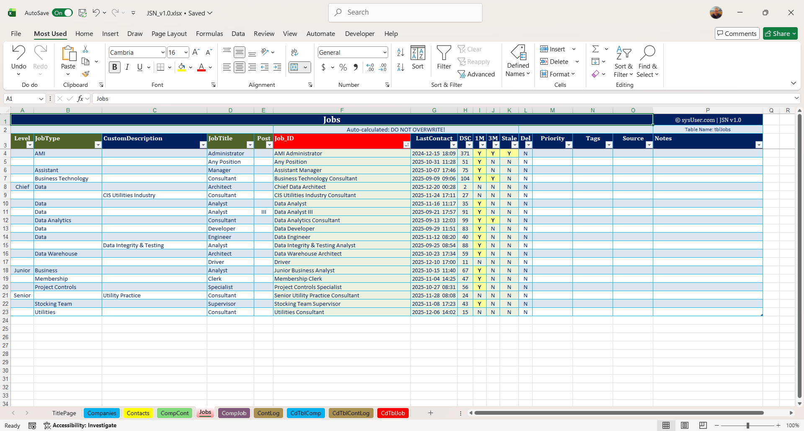
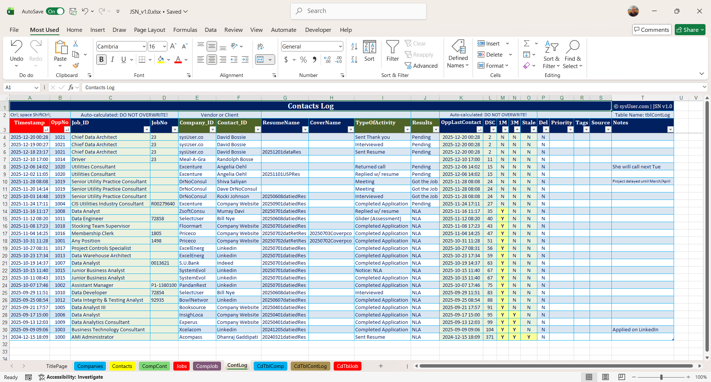

# Job Search Navigator (JSN)

Job Search Navigator (JSN) is a structured Excel-based system for managing an active job search.

It was built to track companies, contacts, job roles, and outreach in one place, with built-in follow-up indicators so nothing slips through the cracks.

## What this is

JSN is not a demo spreadsheet or a one-sheet tracker.  
It’s a small analytics system designed using real-world data modeling principles.

## Features

- Separate tables for Companies, Contacts, Jobs, and a Contact Log
- Junction tables to model real relationships (Company–Contact, Company–Job)
- Automatically calculated follow-up indicators (1M / 3M / stale)
- Clean, table-based layouts designed for sorting and filtering
- Built entirely in Excel (no macros, no external tools)

## Who it’s for

- Job seekers who want structure and clarity
- Analysts who appreciate clean data modeling
- Anyone managing a high-volume or long-running job search

## Product page

The full version (Excel workbook + user guide) is available here:

https://sysusercom.gumroad.com/l/jenazy

## About

This project reflects experience in:
- Data modeling
- Workflow design
- Analytics system architecture
- Business logic translation
- Documentation and delivery

- ## Screenshots

### Workbook overview

### Companies table

### Contacts table

### Jobs table

### Contact log and follow-up tracking

